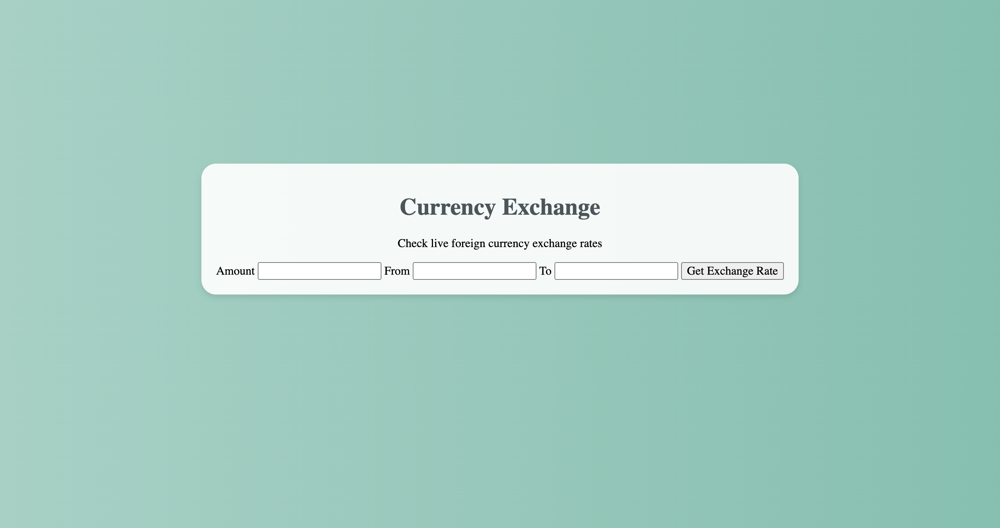

# 📊 Project: Simple API 2

### Goal: Display data returned from an api

App link: https://alejandralondev.github.io/simple-api2-bootcamp/

This app is a simple currency exchange application which fetches conversion rates from an API. The app allows the user to enter a number amount desired to convert in the input field. The user then writes the appropriate abbreviation from and to desired currency. The display shows the final amount conversion.

How It's Made:
Tech used: HTML, CSS, JavaScript,

It took a long time to retrieve the data from the API, this was mainly because I had a vision for a drop down menu for selecting currencies. I was not able to accomplish this as I found out the API query parameters did not take what I wanted it to take. I wound up scrapping my first project pushed and rewrote the code so that it was simpler and worked.

Lessons Learned:
Go with your gut if you feel the project needs to take another approach.