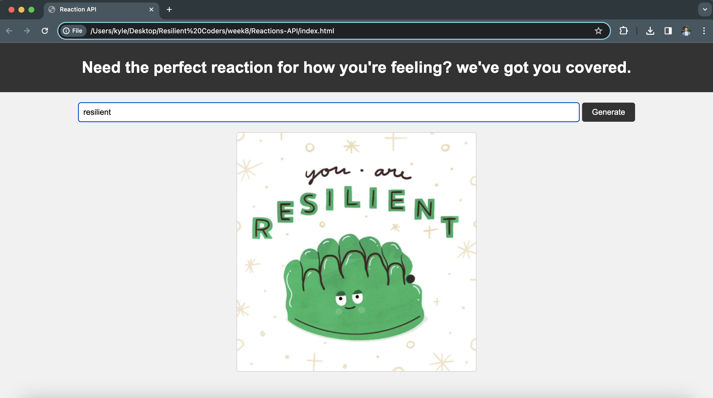

# Reaction API

## Overview 🤯😎👀

The Giphy GIF Search is a web application that allows users to search for GIFs from Giphy and display them. It provides a simple interface for users to enter a search term, and the application fetches and displays a GIF related to that search term.

## Features

- **GIF Search:** Enter a search term and click the "Search" button to find GIFs related to the term.
- **Interactive:** Supports both clicking the "Generate" button and pressing Enter after typing the search term.
- **GIF Display:** The application displays the first matching GIF from Giphy.

## Technologies Used

- **HTML:** The structure of the web page.
- **CSS:** Styling and layout of the app.
- **JavaScript:** To interact with the Giphy API and display GIFs.
- **Giphy API:** Provides a source of GIFs based on search terms.
