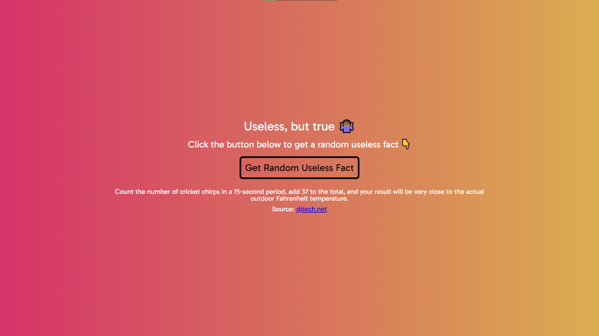

# Useless Fact Generator 🤔

## Project Description

The Useless Fact Generator is a quirky project designed to provide users with a dose of randomness by displaying a useless fact each time the user clicks a button. It's a lighthearted and entertaining way to learn something entirely unexpected.

## How It's Made 🛠️

- **Technologies Used:** HTML, CSS, Vanilla JavaScript, Fetch API
- **Project Organization:**
  - Organized project into folders: css (for styles), js (for JavaScript files), and the root folder containing README and index.html.

## Lessons Learned 🧠

- **Fetch API and Template Literals:**
  - Acquired skills in using the Fetch API to retrieve data dynamically.
  - Expanded knowledge of template literals for efficient string interpolation.
- **Dealing with CORS Error:**
  - Faced challenges with CORS errors during development.
  - Successfully resolved the CORS error by using `https` instead of `http` in the API request.

- **Further Insights into Fetch API:**
  - Gained a deeper understanding of various aspects of the Fetch API.

## Getting Started 🚀

To experience the Useless Fact Generator, follow these steps:

1. Clone the repository.
2. Open the `index.html` file in your preferred web browser.
3. Click the button to receive a new, completely useless fact!

Feel free to contribute, report issues, or provide feedback to make the Useless Fact Generator even more entertaining.