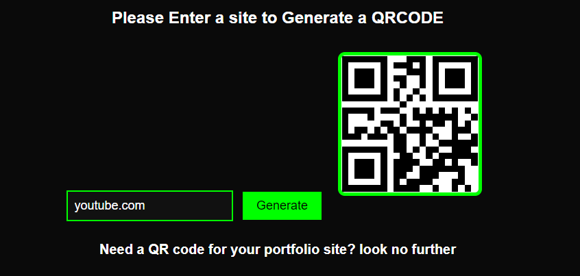

# 📊 Project: Simple API 2

### Goal: Display data returned from an api
This project is a qr code creation tool using a site landing search to print a qr code that can be scanned to direct to that page, this was a really cool project with utility that i use for showing my portfolio.

### How it's Made
Tech used: HTML, CSS, Javascript

### Lessons Learned
I learned alot blob's with this project to link the actual API.

## Example

