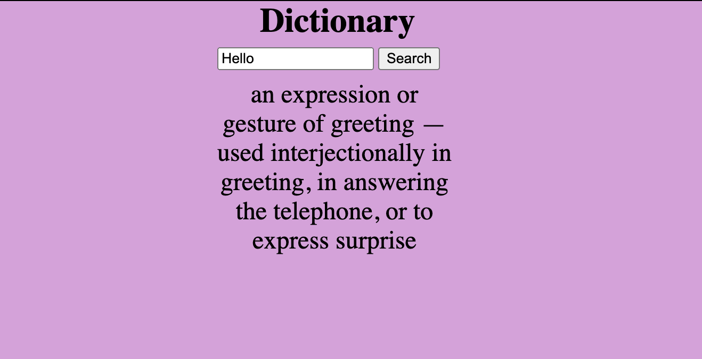

# 📊 Project: Simple API 2

## Link to project 

<a href="https://simpleapi2.netlify.app" rel="nofollow">Visit Website</a>

### Goal: I used an api to return the meaning of inputed word from the dictionary
