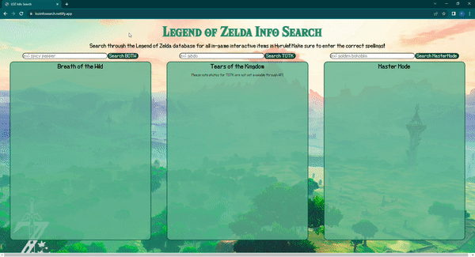

# Legend of Zelda Item Search

A web application that allows the user to search through the Breath of the Wild database, Tears of the Kingdom database, and the Master Mode database for information about any interactable items from the games.

Link to project: https://lozinfosearch.netlify.app/

## How It's Made:

Tech used: HTML, CSS, JavaScript

I used HTML to create the frame of the website. I used CSS to style the sections where the information of the API data will show on the DOM. Then I used JavaScript to create an event listener on the button so that when the user enters an value to the input box, it runs the function. I created a event listener like this for each game version and with their own input elements and button. Then for each game I created a function that pulls information from the Hyrule Condendium API and displays it to the DOM.  

## Optimizations

I noticed that depending on the category of the item search the API returned different types of information. To take that into account, I created a conditional statement that check that data for what category the item was in. Depending on the category, different information would be shown on the DOM. 

## Lessons Learned:

With this project, I learned about how to use one API to do a myriad of things. 