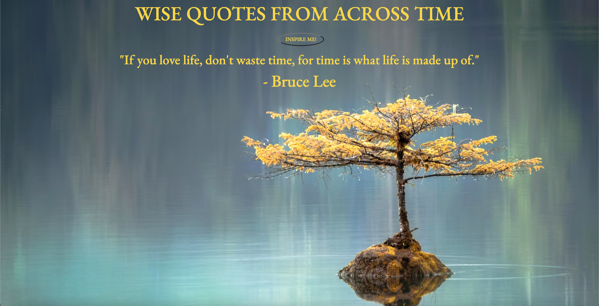

# 🎰 Week08 Bootcamp2021 Project: Simple API 2

### Goal: Display data returned from an api

This is my Simple Quote API project that allows users to fetch a random quote from historical figures across time

</img>

Link to live site: [https://danielmtran-simplequoteapi.netlify.app]

### How It's Made:

Tech used: HTML, CSS, JAVASCRIPT

I made the basic styling and layout of the app via HTML and CSS. The main functionality of the app was made using Javascript.

### Optimizations:

### Lessons Learned:

This project helped me further practice on working with APIs